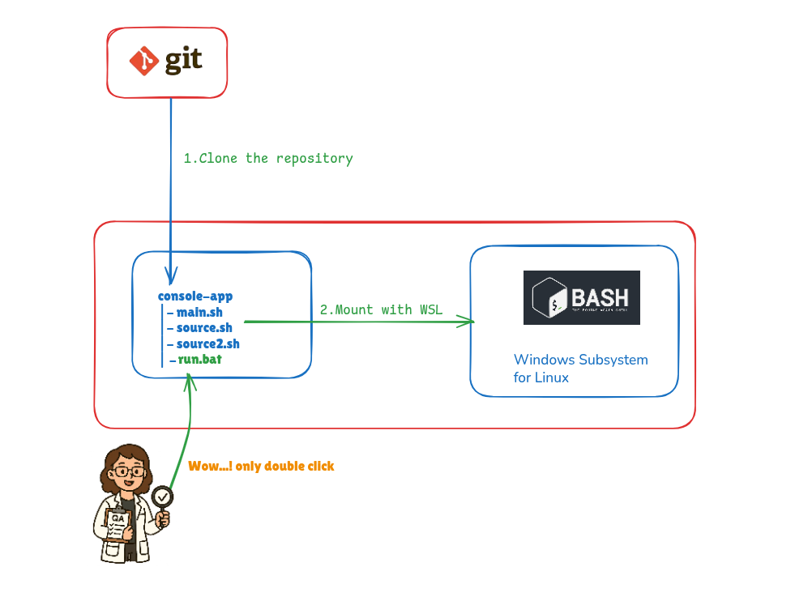

## Shell Runner for Windows
A CLI tool built with Bash for Unix systems, now runnable on Windows 
via WSL (Windows Subsystem for Linux). 
This is packaged in a way that even non-technical users can easily run it—through 
a simple double-click and interactive prompts.

---

---

### Folder Structure
```bash

console-app/
├── main.sh         # Entry point Bash script
├── source.sh       # Helper script
├── source2.sh      # Another helper script
└── run.bat         # Windows batch file to launch CLI using WSL
```
---

#### Background
This tool was originally written for Unix environments, 
but needed to be run by Windows users—without requiring any command-line experience.

#### Problem
* Bash is not natively supported on Windows.
* WSL allows Bash execution, but isn't user-friendly for non-tech users.
* Need a smooth way to run the CLI interactively from Windows.

#### Solution
* Use run.bat to launch the Bash tool inside WSL.

--- 

### Requirements
* WSL installed
* A Linux distribution installed (Ubuntu)

---
### How to Run (Windows)
1. Navigate to the console-app folder.
2. Double-click on run.bat.
3. A terminal window will open.
4. Follow the interactive questions shown in the terminal (e.g., enter Job ID, file name).
5. The CLI will execute the logic based on your responses.

--- 
### What `run.bat` does
* Detects the folder where it’s located.
* Converts the path to WSL format.
* Mounts the folder inside WSL.
* Executes main.sh inside WSL Bash.
* The Bash script takes care of interacting with the user for inputs.


